# OXYCURE ERP — Business Process Flows

> **Version:** 1.0
> **Created:** April 2026
> **Purpose:** Visual reference of all business processes and their interactions

---

## 1. Core Business Flow (Backbone)

This is the end-to-end lifecycle of every deal at Oxycure:

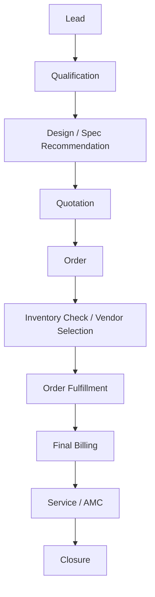

### Stage Descriptions

| Stage | Owner | What Happens | Output |
|-------|-------|-------------|--------|
| Lead | Sales | New prospect enters the system | Lead record created |
| Qualification | Sales | Contact, understand requirement, assess fit | Lead marked as Qualified |
| Design / Spec Recommendation | Design Team | Analyze requirement, recommend product/configuration | Design spec document |
| Quotation | Sales + Design | Create formal quotation with specs and pricing | Quotation PDF |
| Order | Sales | Customer accepts quotation → order confirmed | Order created |
| Inventory Check / Vendor Selection | Operations | Check stock, procure from vendors if needed | Materials ready |
| Order Fulfillment | Operations | Pick, Pack, Dispatch + Installation (if applicable) | Product delivered/installed |
| Final Billing | Finance | Generate invoice, track payment | Invoice + Payment |
| Service / AMC | Service | Post-delivery support, maintenance contracts | Service history |
| Closure | All | Order fully paid, service active, customer satisfied | Complete lifecycle |

---

## 2. Primary Flows (Detailed)

### Flow 1: Lead → Order (Sales)

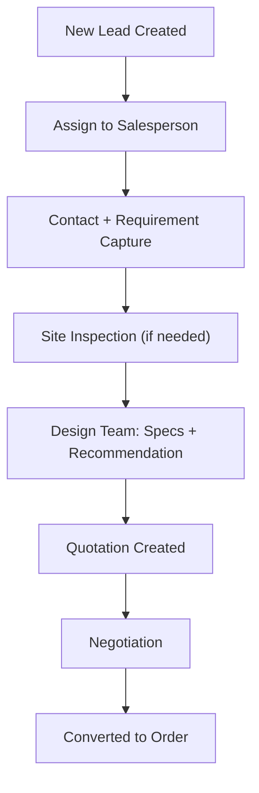

**Key Data at Each Step:**

| Step | Data Captured |
|------|--------------|
| New Lead | Customer info, source, product type (Air Purifier / Moscure / Industrial), estimated value |
| Contact | Requirement notes, follow-up dates, site details |
| Site Inspection | Site photos, dimensions, power availability, environment notes |
| Design/Spec | Product configuration, specifications, recommended solution, BOM |
| Quotation | Line items, pricing, taxes, terms, validity |
| Negotiation | Revised pricing, discount approvals, competitor notes |
| Order | Confirmed items, delivery timeline, payment terms |

---

### Flow 2: Order → Execution (Operations)

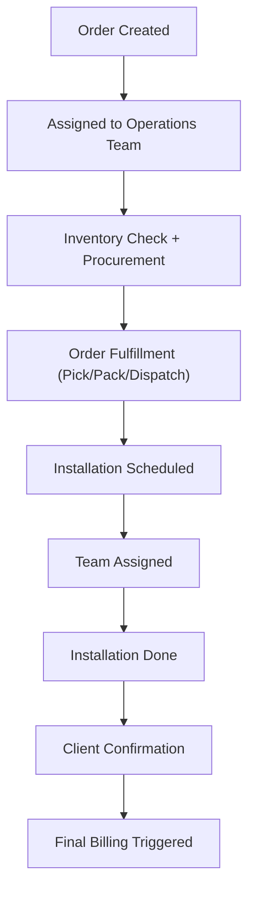

**Key Data at Each Step:**

| Step | Data Captured |
|------|--------------|
| Assigned to Ops | Operations manager, priority |
| Inventory Check | Stock availability, vendor quotes, procurement timeline |
| Fulfillment | Pick list, packing details, dispatch info, courier/transport |
| Installation Scheduled | Date, time, site address, access instructions |
| Team Assigned | Engineers, team lead, required tools/equipment |
| Installation Done | Checklist completed, photos, testing results |
| Client Confirmation | Customer sign-off, handover documents |
| Billing Triggered | Invoice generation initiated |

---

### Flow 3: Service / AMC

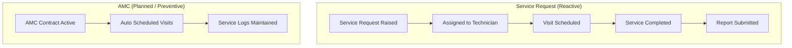

**Two Modes:**
- **Reactive:** Customer raises complaint/request → technician dispatched → resolved
- **Proactive (AMC):** Scheduled preventive maintenance → auto-generated visits → service logs

---

### Flow 4: Payment (Finance)

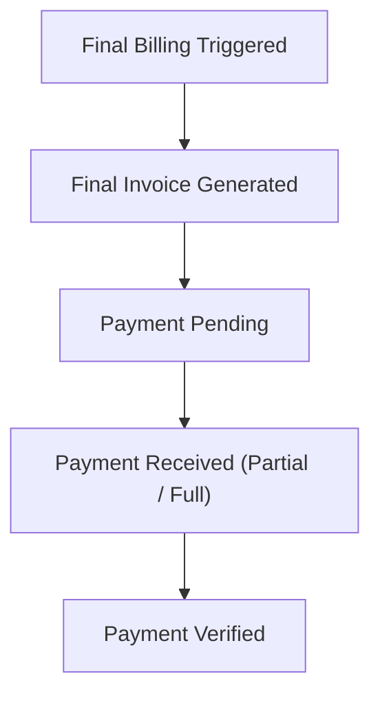

**Payment Terms Tracking:**
- Advance payment at order confirmation
- Progress payments during fulfillment/installation
- Final payment on completion + billing
- AMC payments (recurring)

---

### Flow 5: Inventory (Phase 2)

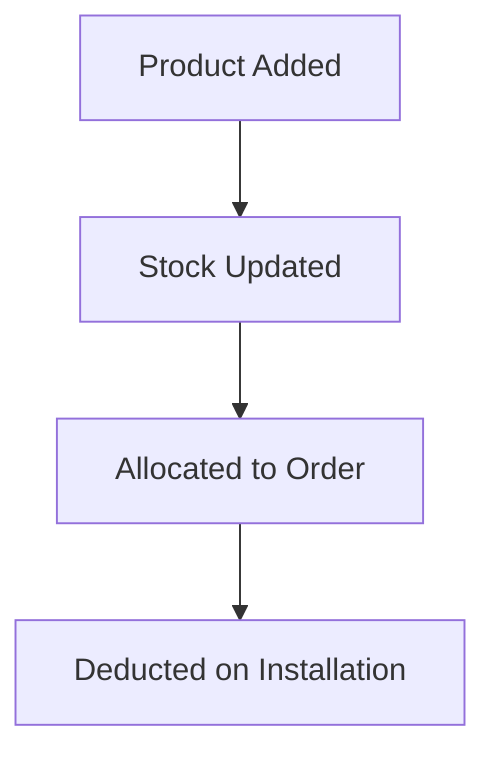

**Procurement Sub-flow:**
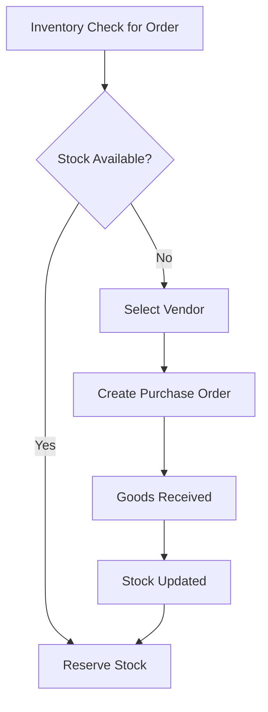

---

## 3. Supporting Flows

### User & Role Management

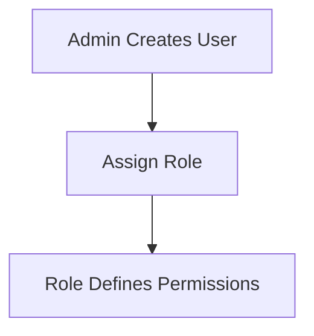

**Roles:**
| Role | Departments | Access Level |
|------|------------|-------------|
| Admin | All | Full system control |
| Sales | Sales | Leads, quotations, orders |
| Operations | Operations | Fulfillment, installations, inventory |
| Technician | Service | Service tickets, AMC visits |
| Accounts | Finance | Invoices, payments, expenses |

### Reporting

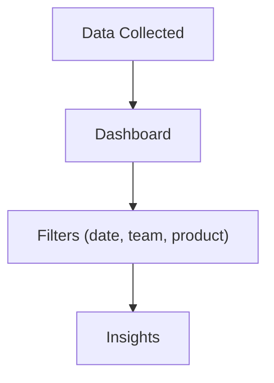

---

## 4. UI Structure (Sidebar Navigation)

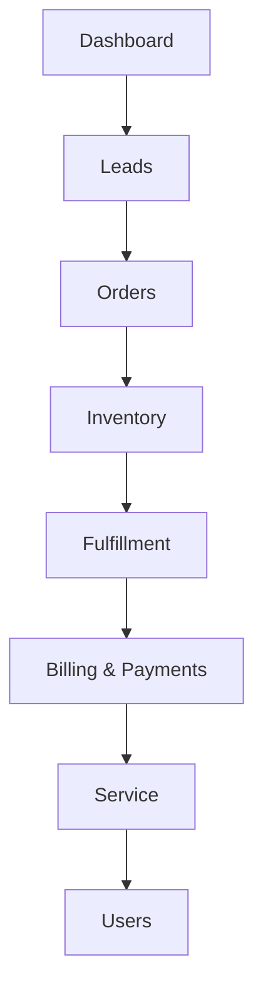

### Screen Map

| Section | Key Screens |
|---------|------------|
| **Dashboard** | Executive overview, role-specific KPIs, alerts |
| **Leads** | Lead list, lead detail, create lead, pipeline board, design specs |
| **Orders** | Order list, order detail, create order, order timeline |
| **Inventory** | Product catalog, stock levels, low stock alerts, vendors |
| **Fulfillment** | Fulfillment queue, pick/pack, dispatch tracking, installations |
| **Billing & Payments** | Invoices, payments, overdue, expenses |
| **Service** | Tickets, AMC contracts, scheduled visits, service history |
| **Users** | User list, roles, permissions, activity logs |

---

## 5. Status Systems

### Lead Status

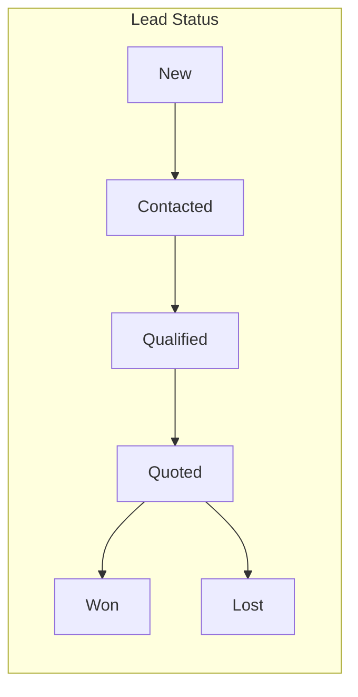

| Status | Meaning | Trigger |
|--------|---------|---------|
| **New** | Just entered the system | Lead created |
| **Contacted** | Salesperson made first contact | First call/meeting logged |
| **Qualified** | Requirement understood, genuine opportunity | Requirement captured + design spec requested |
| **Quoted** | Quotation sent to customer | Quotation created and sent |
| **Won** | Customer accepted, order created | Lead converted to order |
| **Lost** | Deal did not close | Lost reason recorded |

### Order Status

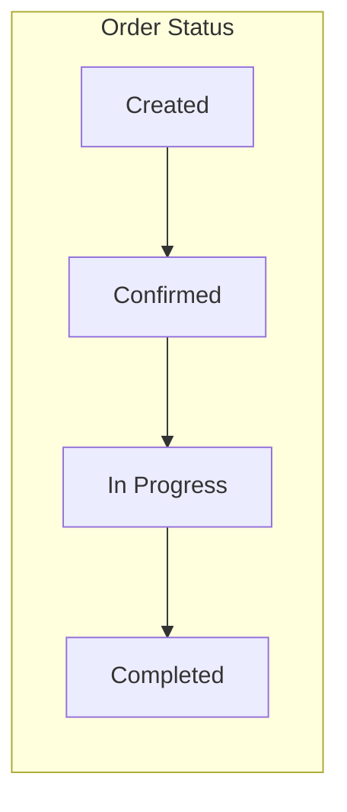

| Status | Meaning | Trigger |
|--------|---------|---------|
| **Created** | Order record created from won lead | Lead conversion |
| **Confirmed** | Customer confirmed, advance received (if applicable) | Payment/confirmation received |
| **In Progress** | Fulfillment/installation underway | Operations team starts work |
| **Completed** | Delivered/installed and signed off | Customer sign-off |

### Service Status

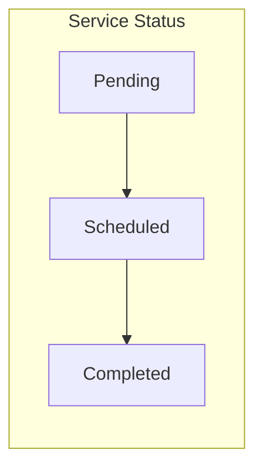

---

## 6. Design Principle

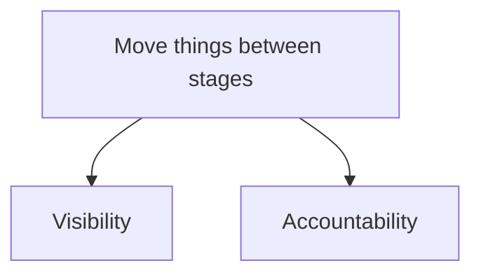

> **Every entity in the system moves through defined stages.**
> At each stage, someone is responsible, and everyone can see the current state.

---

## 7. MVP Scope (Phase 1)

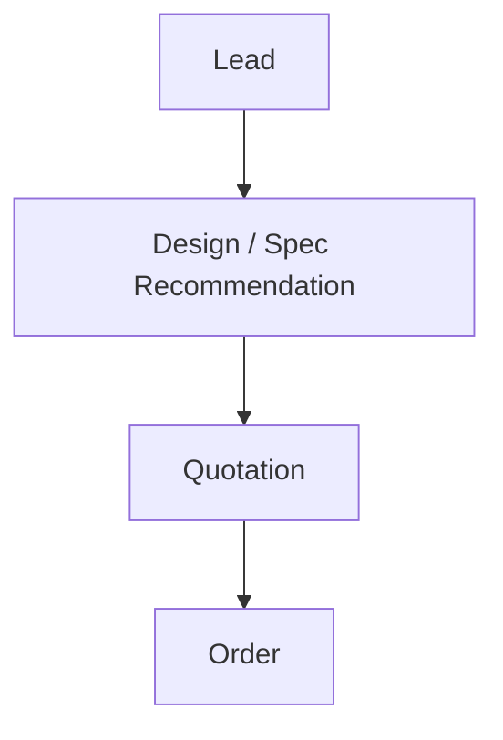

The MVP focuses on the **sales backbone** — from first contact to confirmed order.
Design/Spec Recommendation is included because it's core to Oxycure's sales process
(customers need technical specifications before they can evaluate a quotation).

### What MVP Answers
- Can we capture every lead without leakage?
- Can the design team provide specs efficiently?
- Can we generate quotations from specs?
- Can we track which leads become orders?
- Do we have full accountability at every stage?

---

## 8. Cross-Flow Touchpoints

| From Flow | To Flow | Trigger | Data Passed |
|-----------|---------|---------|-------------|
| Lead → Order | Order → Execution | Lead status = Won | Customer, products, specs, quotation |
| Order → Execution | Payment | Installation complete + sign-off | Order total, billing address, payment terms |
| Order → Execution | Service/AMC | Installation signed off | Installation details, warranty dates, products |
| Payment | Closure | Full payment received | Payment confirmation |
| Service/AMC | Payment | Chargeable service completed | Service cost, parts used |
| Inventory | Order → Execution | Stock allocated/procured | Available stock, vendor info |

---

*This document is the "map" of Oxycure's business. Every feature we build should trace back to one of these flows.*
